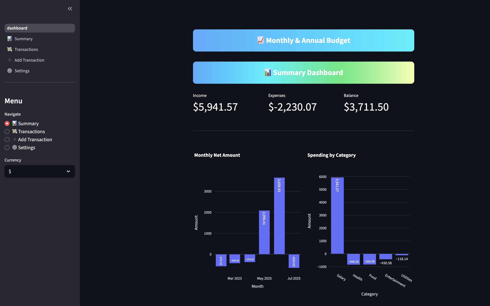
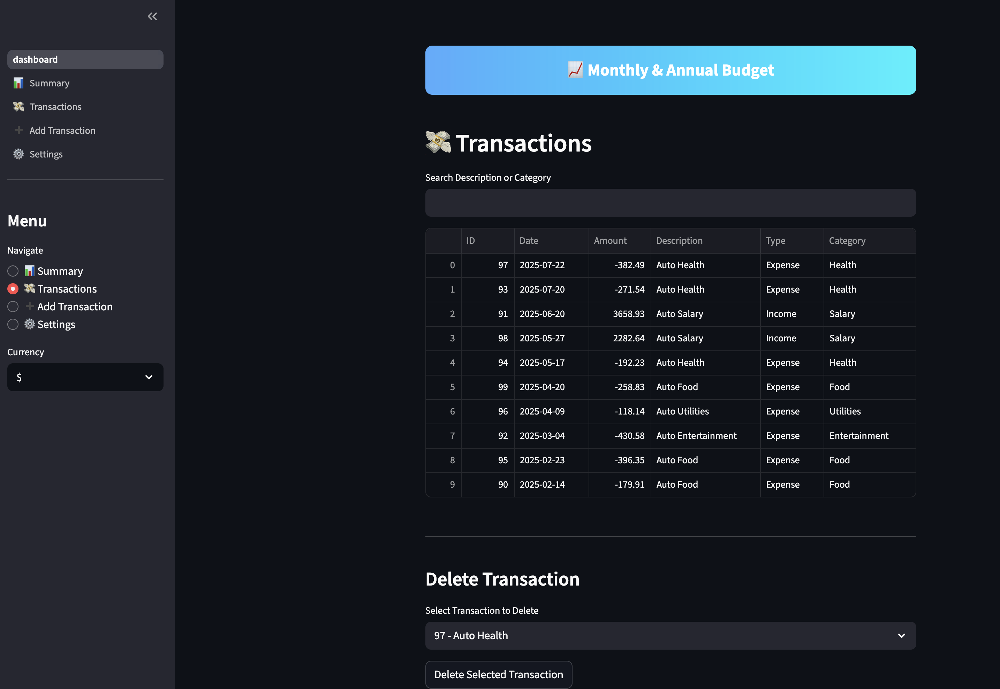
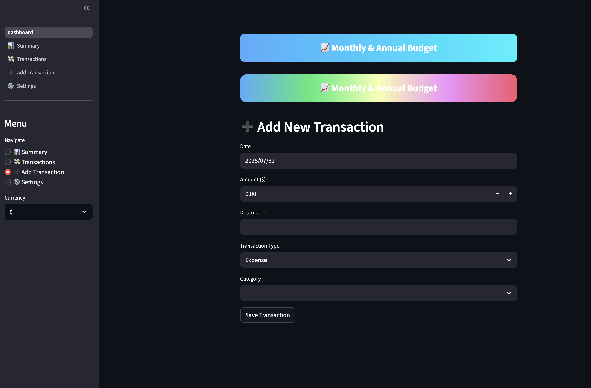
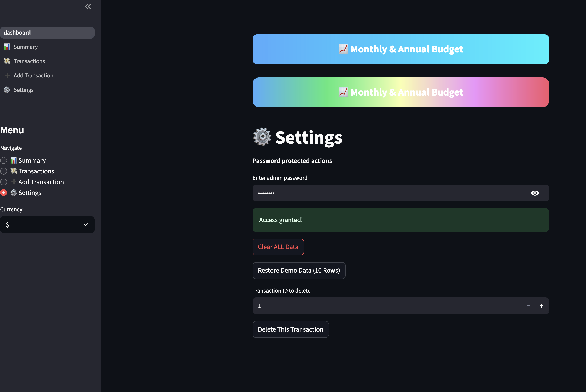

# 📈 Monthly & Annual Budget App

[](CONTRIBUTING.md)
[](https://github.com/DhimySoft/mini_budget_tracker)
[](https://github.com/DhimySoft/mini_budget_tracker)
[](https://github.com/DhimySoft/mini_budget_tracker/commits/main)
[](https://www.python.org/)
[](LICENSE)
[](https://streamlit.io)
[](https://github.com/DhimySoft/mini_budget_tracker/issues)
[](https://github.com/DhimySoft/mini_budget_tracker/fork)
[](https://github.com/DhimySoft/mini_budget_tracker/stargazers)

A lightweight budget tracker for personal and business finances.  
Built with **Python, Streamlit, and SQLite**.

---

## ✨ Features
- Add income and expense transactions with type-based auto-calculations.
- Categorize spending (auto-negative for expense type).
- Visual summary dashboard:
  - Monthly net results
  - Spending by category
- Secure settings page with password-protected data management.

---

## 🚀 Live Demo
**[👉 Launch the App Here](https://dhimysoft-mini-budget-tracker-dashboard-wbhq5i.streamlit.app/)**

---

## 🖥️ Installation
**Python 3.10+ recommended**
```bash
git clone https://github.com/DhimySoft/mini_budget_tracker.git
cd mini_budget_tracker
pip install -r requirements.txt
streamlit run dashboard.py
```

📸 Screenshots
<table> <tr> <td></td> <td></td> </tr> <tr> <td></td> <td></td> </tr> </table>

🤝 Contributing
We welcome contributions from the community!
See our CONTRIBUTING.md for guidelines on how to get started.

👨‍💻 Author
Created by Dhimy Jean
Computer Science Student | Python & SQL | Aspiring AI & Software Developer

📄 License
This project is licensed under the MIT License – free for personal and commercial use.
## 🚀 Live Demo
**[👉 Launch the App Here](https://dhimysoft-mini-budget-tracker-dashboard-wbhq5i.streamlit.app/)**  
> **Note:** This live demo uses a **demo dataset** for showcase purposes only. All transactions and balances are sample data.


## 🚀 Live Demo
**[👉 Launch the App Here](https://dhimysoft-mini-budget-tracker-dashboard-wbhq5i.streamlit.app/)**  
> **Note:** This live demo uses a **demo dataset** for showcase purposes only. All transactions and balances are sample data.

